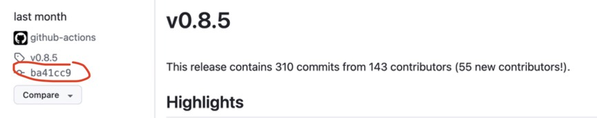
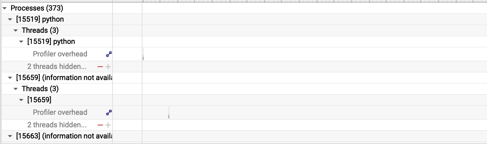

# Installation

```bash
# https://github.com/vllm-project/vllm/issues/12577#issuecomment-2757027368
export VLLM_PRECOMPILED_WHEEL_LOCATION=https://files.pythonhosted.org/packages/15/77/7beca2061aadfdfd2d81411102e6445b459bcfedfc46671d4712de6a00fb/vllm-0.8.0-cp38-abi3-manylinux1_x86_64.whl

VLLM_USE_PRECOMPILED=1 pip install -e third_party/vllm # This step might take a while


# For vllm 0.8.5, you need re-install the newer precompiled wheel
export https://wheels.vllm.ai/ba41cc90e8ef7f236347b2f1599eec2cbb9e1f0d/vllm-0.8.5-cp38-abi3-manylinux1_x86_64.whl

pip install -e third_party/vllm
```

## Error

```bash
ImportError: .../flash_attn_2_cuda.cpython-312-x86_64-linux-gnu.so: undefined symbol: _ZN3c104cuda9SetDeviceEi
```

```bash
pip uninstall flash-attn

# Collect all version info
pip show torch
nvcc -V
python --version

# Pick the corresponding release from https://github.com/Dao-AILab/flash-attention/releases (abiFALSE)
wget https://github.com/Dao-AILab/flash-attention/releases/download/v2.7.4.post1/flash_attn-2.7.4.post1+cu12torch2.6cxx11abiFALSE-cp312-cp312-linux_x86_64.whl

pip install workspace/flash_attn-2.7.4.post1+cu12torch2.6cxx11abiFALSE-cp312-cp312-linux_x86_64.whl
```

### Update to vLLM 0.8.5 using gitsubrepo

```shell
# what git subrepo really do
git subrepo fetch <subdir> (v0.8.5)
git subrepo branch <subdir> (v0.8.0)
git merge/rebase subrepo/<subdir>/fetch subrepo/<subdir> (resolve conflicts)
git subrepo commit <subdir>
# Only needed for a consequential push:
git update-ref refs/subrepo/<subdir>/pull subrepo/<subdir>
```

* Find corresponding pre-compiled vLLM wheel
    * Get version branch, find the final commit id



`export VLLM_PRECOMPILED_WHEEL_LOCATION=https://wheels.vllm.ai/ba41cc90e8ef7f236347b2f1599eec2cbb9e1f0d/vllm-0.8.5-cp38-abi3-manylinux1_x86_64.whl`

or

`export VLLM_PRECOMPILED_WHEEL_LOCATION=https://github.com/vllm-project/vllm/releases/download/v0.8.5/vllm-0.8.5-cp38-abi3-manylinux1_x86_64.whl`

Then

`pip install -e third_party/vllm`

### Solve vLLm workers crash and NVTX Empty Result

* Get the latest version of Nsight System otherwise you'll crash the vllm worker when init NCCL

* Set arg `--trace-fork-before-exec=true`, or get the empty trace results when tracing NVTX

> If true, trace any child process after fork and before they call one of the exec functions. Beware, tracing in this interval relies on undefined behavior and might cause your application to crash or deadlock.



# Run

Can run on 4 RTX4090(24GB).

```bash
srun --nodes=1 --gpus=4 --mail-type=ALL --pty bash

python workspace/prof.py
```

